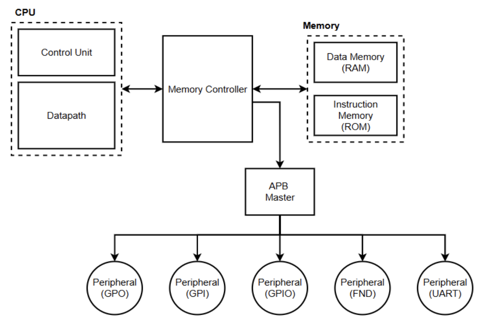
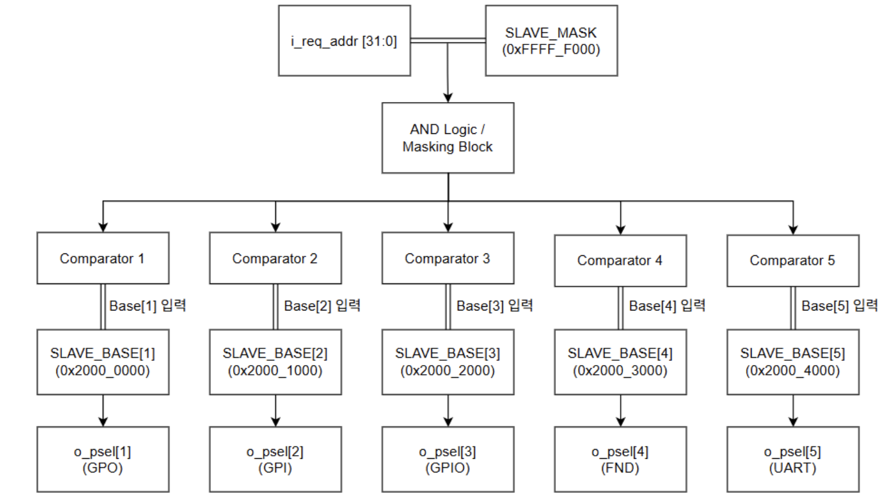

# ⚙️ RV32I Multi-cycle CPU 기반 APB Bus 및 Peripheral 시스템

> RV32I Multi-cycle CPU와 GPO, GPI, GPIO, FND, UART 주변장치를  
> AMBA APB Bus로 연결하고, Memory Map 기반 Address Decoding을 구현한 3인 팀 프로젝트입니다.

---

## 📌 프로젝트 개요

RV32I Multi-cycle CPU가 여러 주변장치를 제어할 수 있도록  
CPU, Memory Controller, APB Master, Peripheral을 하나의 시스템으로 통합했습니다.

CPU에서 발생한 주소와 Read/Write 요청은 Memory Controller를 거쳐  
Memory 또는 APB Master로 전달됩니다.

Peripheral 접근 요청이 발생하면 APB Bridge의 Address Decoding 로직이  
요청 주소에 해당하는 장치의 `PSEL` 신호를 생성하며,  
Memory-Mapped I/O 방식으로 GPO, GPI, GPIO, FND, UART를 제어합니다.

본인은 전체 프로젝트 중 **AMBA APB Bus Protocol, Memory Map, Address Decoding 및 Peripheral Interface 연동**을 담당했습니다.

---

## 👥 팀 구성

**3인 팀 프로젝트**

| 담당 영역 | 주요 내용 |
| --- | --- |
| CPU | RV32I Multi-cycle CPU 및 명령어 처리 구조 |
| Bus | AMBA APB Protocol, Memory Map, Address Decoding |
| Peripheral | GPO, GPI, GPIO, FND, UART 구현 및 연동 |

---

## 🙋 담당 역할

- AMBA APB Bus Protocol 분석
- APB Master의 `IDLE → SETUP → ACCESS` Transaction 구조 분석
- Peripheral별 Base Address 및 Memory Map 구성
- Address Masking 및 Comparator 기반 Address Decoding 구현
- 요청 주소에 따른 Peripheral별 `PSEL` 생성 로직 구현
- APB Bus와 GPO, GPI, GPIO, FND, UART Interface 연동
- APB Read/Write Transaction 시뮬레이션 및 신호 검증
- `PSEL`, `PENABLE`, `PWRITE`, `PREADY`, `PWDATA`, `PRDATA` 신호 흐름 분석

> CPU와 Peripheral 모듈은 팀원들과 함께 통합했으며,  
> 본인은 APB Bus와 Address Decoding을 중심으로 구현 및 검증했습니다.

---

## 🛠 사용 기술

### HDL

- Verilog HDL
- SystemVerilog

### Processor & Bus

- RISC-V
- RV32I Multi-cycle CPU
- AMBA APB
- Memory-Mapped I/O
- Address Decoding
- FSM

### Peripheral

- GPO
- GPI
- GPIO
- FND
- UART

### Tools

- Vivado
- Simulation
- Waveform Analysis

---

## 🏗 시스템 구성

RV32I Multi-cycle CPU에서 발생한 Memory Access 요청은  
Memory Controller를 통해 Memory 또는 APB Master로 전달됩니다.

ROM과 RAM 영역은 Memory Controller가 직접 처리하고,  
Peripheral 영역은 APB Master를 통해 각 주변장치로 전달됩니다.

```text
RV32I Multi-cycle CPU
          ↓
   Memory Controller
      ↙          ↘
 ROM / RAM     APB Master
                    ↓
            Address Decoding
                    ↓
      ┌──────┬──────┬──────┬──────┬──────┐
      │ GPO  │ GPI  │ GPIO │ FND  │ UART │
      └──────┴──────┴──────┴──────┴──────┘
```

<p align="center">
  
</p>

<p align="center">
  <b>RV32I Multi-cycle CPU 기반 APB Peripheral 시스템 구성</b>
</p>

---

## 🗺 Memory Map

Memory와 Peripheral에 각각 독립적인 주소 영역을 할당했습니다.

| Base Address | 대상 | 역할 |
| --- | --- | --- |
| `0x0000_0000` | ROM | Instruction Memory |
| `0x1000_0000` | RAM | Data Memory |
| `0x2000_0000` | GPO | 16-bit General-Purpose Output |
| `0x2000_1000` | GPI | 16-bit General-Purpose Input |
| `0x2000_2000` | GPIO | 16-bit Bidirectional GPIO |
| `0x2000_3000` | FND | 4-digit 7-Segment 제어 |
| `0x2000_4000` | UART | UART TX/RX 및 상태 제어 |

각 Peripheral에 `0x1000` 단위의 주소 공간을 할당해  
요청 주소에 따라 하나의 장치만 선택되도록 구성했습니다.

---

## 🔍 APB Bridge Address Decoding

CPU의 요청 주소 `i_req_addr[31:0]`에 `SLAVE_MASK`를 적용한 뒤,  
각 Peripheral의 Base Address와 비교하여 해당 장치의 `PSEL` 신호를 생성했습니다.

```text
CPU Request Address
        ↓
SLAVE_MASK 적용
        ↓
Peripheral Base Address 비교
        ↓
해당 Peripheral PSEL 활성화
```

<p align="center">
  
</p>

<p align="center">
  <b>APB Bridge Address Decoding 구조</b>
</p>

### Address Decoding 결과

| Base Address | 선택 신호 | Peripheral |
| --- | --- | --- |
| `0x2000_0000` | `PSEL[1]` | GPO |
| `0x2000_1000` | `PSEL[2]` | GPI |
| `0x2000_2000` | `PSEL[3]` | GPIO |
| `0x2000_3000` | `PSEL[4]` | FND |
| `0x2000_4000` | `PSEL[5]` | UART |

하나의 APB Bus를 여러 Peripheral이 공유하면서도  
요청 주소에 해당하는 장치의 `PSEL`만 활성화되도록 구현했습니다.

---

## 🔄 APB Transaction

APB Transaction은 `SETUP`과 `ACCESS` 단계로 구성됩니다.

### SETUP 단계

- `PSEL` 활성화
- `PADDR` 설정
- `PWRITE` 설정
- Write Transaction일 경우 `PWDATA` 설정
- `PENABLE` 비활성화

### ACCESS 단계

- `PENABLE` 활성화
- 선택된 Peripheral이 Read 또는 Write 수행
- `PREADY`가 활성화되면 Transaction 완료
- Read Transaction일 경우 `PRDATA` 수신

```text
IDLE
  ↓ Request
SETUP
  ↓
ACCESS
  ↓ PREADY
IDLE
```

---

## 🧠 APB Master FSM

APB Master는 CPU의 요청과 `PREADY` 상태에 따라 동작합니다.

| 상태 | 주요 동작 |
| --- | --- |
| IDLE | CPU의 Peripheral Access 요청 대기 |
| SETUP | 주소, 데이터, `PSEL`, `PWRITE` 설정 |
| ACCESS | `PENABLE` 활성화 및 실제 Transaction 수행 |
| 완료 | `PREADY` 확인 후 IDLE 복귀 |

APB Protocol의 SETUP과 ACCESS 단계가 명확히 구분되도록  
FSM을 구성해 제어 신호의 순서와 타이밍을 유지했습니다.

---

## ✨ 주요 구현 내용

### 1. Memory Map 기반 Peripheral 선택

- Peripheral별 Base Address 정의
- 주소 영역에 따른 독립적인 장치 선택
- 동일한 APB Bus에서 여러 Peripheral 공유
- 하나의 요청에 하나의 `PSEL`만 활성화

### 2. Address Masking 및 Comparator 구조

- `SLAVE_MASK`를 이용해 Peripheral 구분 주소 영역 추출
- 요청 주소와 각 Peripheral Base Address를 병렬 비교
- 비교 결과에 따라 개별 `PSEL` 신호 생성

### 3. APB Read/Write Transaction

- `PWRITE=1`일 때 Write Transaction 수행
- `PWDATA`를 선택된 Peripheral에 전달
- `PWRITE=0`일 때 Read Transaction 수행
- 선택된 Peripheral의 `PRDATA`를 CPU 방향으로 반환

### 4. Peripheral Interface 통합

- GPO 출력 데이터 제어
- GPI 입력 데이터 읽기
- GPIO 양방향 입출력
- FND 데이터 및 제어 Register 접근
- UART TX/RX 및 상태 Register 접근

---

## ⚠️ 문제 해결

### Peripheral 선택 충돌 방지

| 구분 | 내용 |
| --- | --- |
| 문제 | 여러 Peripheral이 하나의 APB Bus를 공유해 잘못된 장치가 선택될 가능성이 있음 |
| 원인 | 요청 주소에 따른 Peripheral 구분 로직 필요 |
| 해결 | Peripheral별 Base Address와 Address Mask를 정의하고 Comparator로 주소 비교 |
| 결과 | 요청 주소에 해당하는 하나의 `PSEL`만 활성화되도록 구현 |

### APB 제어 신호 타이밍

| 구분 | 내용 |
| --- | --- |
| 문제 | `PSEL`과 `PENABLE`의 활성화 순서가 어긋나면 APB Protocol 위반 발생 |
| 원인 | APB의 SETUP과 ACCESS 단계가 명확히 분리되어야 함 |
| 해결 | APB Master FSM을 통해 단계별 제어 신호를 순차적으로 생성 |
| 결과 | APB Protocol에 맞는 안정적인 Read/Write Transaction 구현 |

---

## ✅ 검증 내용

### Address Decoding 검증

- Peripheral별 Base Address 확인
- 요청 주소에 따른 `PSEL` 선택 확인
- 한 번의 요청에 하나의 Peripheral만 선택되는지 확인
- 주소 범위 외 요청 시 모든 `PSEL` 비활성화 확인

### APB Write Transaction 검증

- SETUP 단계의 `PSEL`, `PADDR`, `PWRITE`, `PWDATA` 확인
- ACCESS 단계의 `PENABLE` 활성화 확인
- `PREADY` 기반 Transaction 완료 확인
- Peripheral Register에 Write Data 반영 확인

### APB Read Transaction 검증

- Read 요청 주소에 따른 Peripheral 선택 확인
- 선택된 Peripheral의 `PRDATA` 반환 확인
- `PREADY` 활성화 후 CPU 방향 데이터 전달 확인

### Peripheral 연동 검증

- GPO 출력 데이터 정상 반영
- GPI 입력 데이터 정상 Read
- GPIO 입출력 동작 확인
- FND Register 접근 및 출력 확인
- UART Register 접근 및 데이터 송수신 확인

---

## 📊 검증 결과

### Address Decoding 결과

CPU 요청 주소에 따라 해당 Peripheral의 `PSEL` 신호만 활성화되고,  
다른 Peripheral의 선택 신호는 비활성화되는 것을 확인했습니다.

### APB Read/Write 결과

APB Master가 `IDLE → SETUP → ACCESS` 상태를 순서대로 수행하고,  
`PREADY`가 활성화된 시점에 Transaction이 정상적으로 종료되는 것을 확인했습니다.

### Peripheral 연동 결과

Memory-Mapped I/O 방식으로 GPO, GPI, GPIO, FND, UART에 접근했으며,  
각 Peripheral의 Read/Write 동작이 정상적으로 수행되는 것을 확인했습니다.

---

## 📂 프로젝트 구조

```text
rv32i-apb-peripheral-system/
├── README.md
├── rtl/
│   ├── cpu/
│   ├── memory_controller/
│   ├── apb_master/
│   ├── address_decoder/
│   └── peripheral/
│       ├── gpo/
│       ├── gpi/
│       ├── gpio/
│       ├── fnd/
│       └── uart/
├── simulation/
├── constraints/
├── images/
│   ├── apb_system_block_diagram.png
│   └── apb_address_decoder.png
└── docs/
```

> 소스코드 업로드 후 실제 파일 구성에 맞게 폴더명과 파일명을 수정할 예정입니다.

---

## 💡 프로젝트를 통해 배운 점

CPU와 여러 Peripheral을 하나의 시스템으로 연결하면서  
SoC 구조에서 Bus Interface가 수행하는 역할을 이해할 수 있었습니다.

특히 Memory-Mapped I/O 방식에서는 Peripheral별 주소 할당과  
Address Decoding의 정확성이 전체 시스템 동작에 직접적인 영향을 준다는 점을 확인했습니다.

또한 APB Protocol의 SETUP과 ACCESS 단계를 FSM으로 제어하고,  
`PSEL`, `PENABLE`, `PREADY` 신호의 타이밍을 시뮬레이션으로 분석하며  
Bus Protocol 설계와 Peripheral Interface 통합 경험을 쌓았습니다.

팀 프로젝트 과정에서는 CPU, Bus, Peripheral로 역할을 나누고  
각 모듈의 Interface를 맞춰 하나의 시스템으로 통합하는 협업 경험도 얻었습니다.
